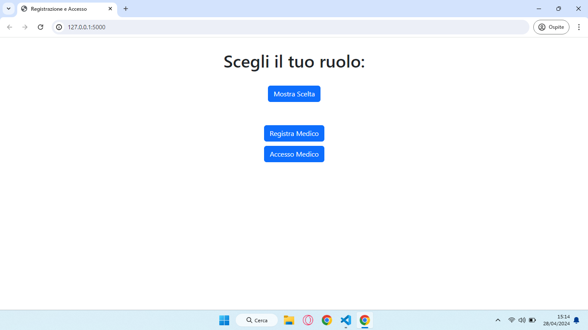
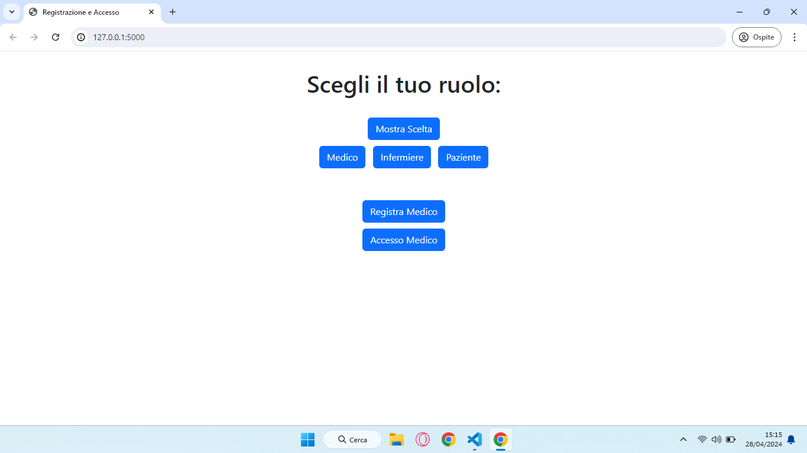
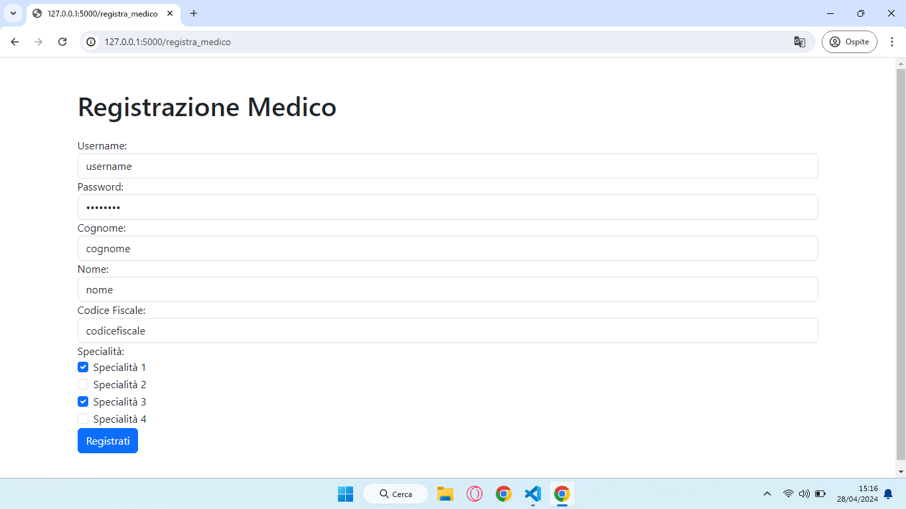
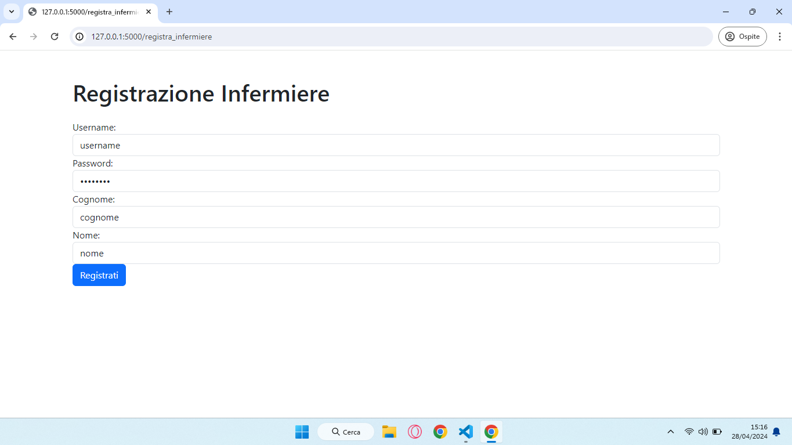
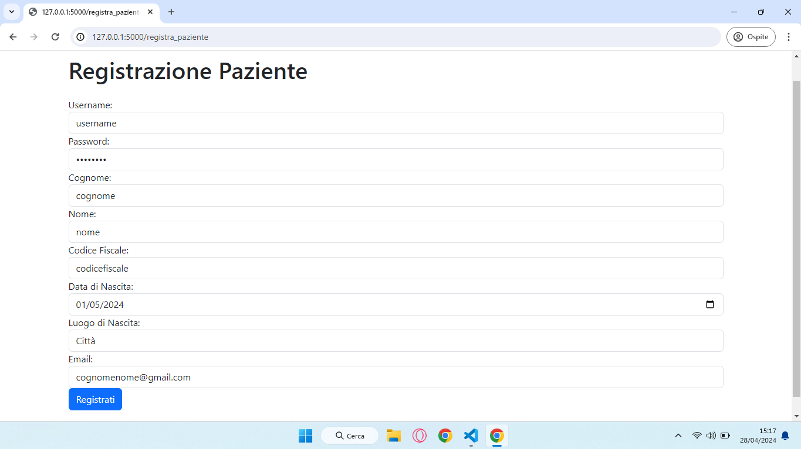
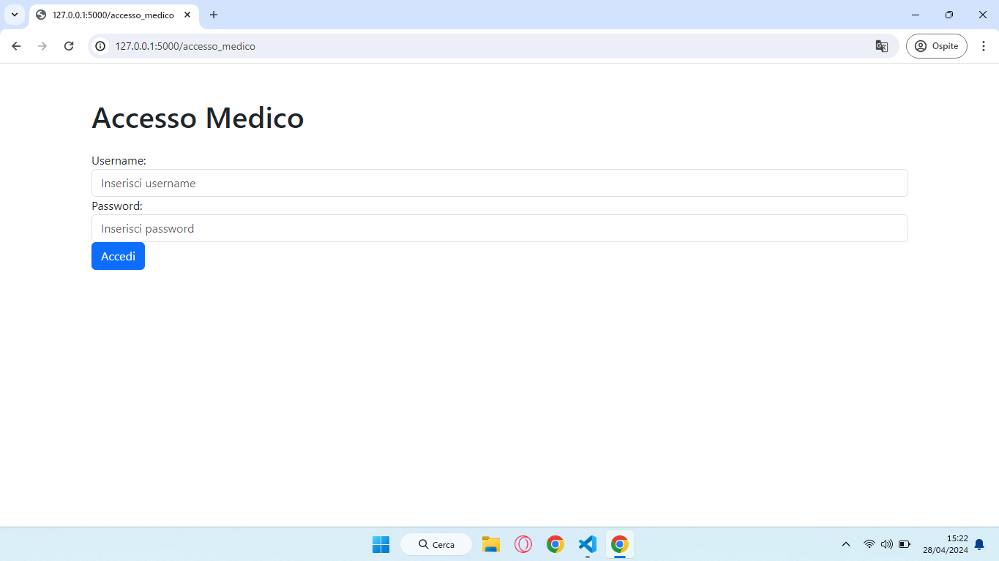
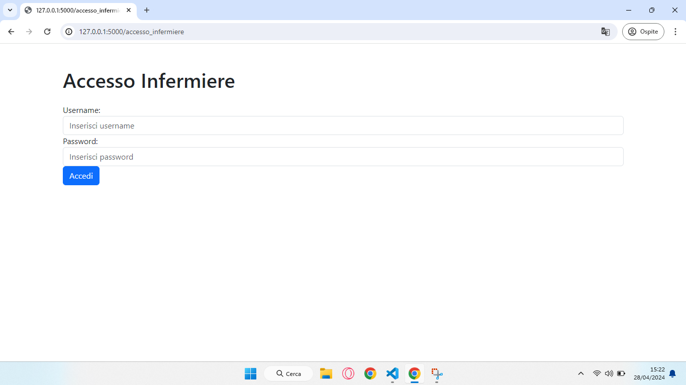
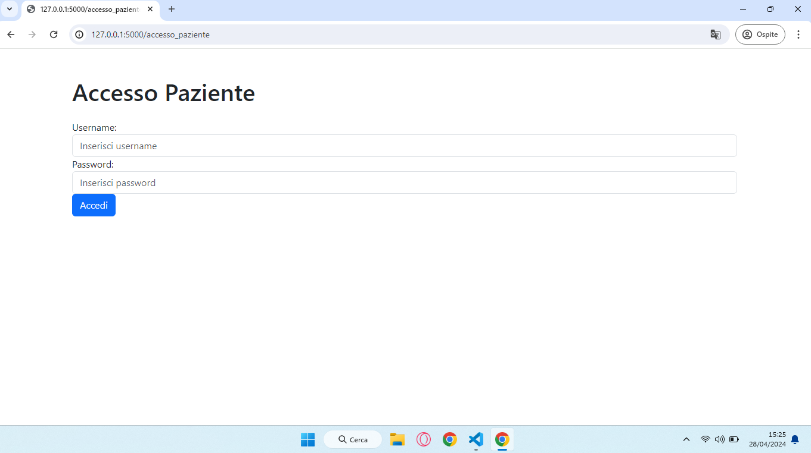

### Download 
```
https://github.com/maftahoualid/ingsw/archive/refs/heads/main.zip
```
### Install
- Python3
```
sudo apt-get install python3.6
```
- Flask
```
pip install flask
```
### Run
```
python3 main.py
```
### Browse 
```
http://127.0.0.1:5000/
```
## Screens
Home

Scelta



Mostra Scelta

Registra



Accedi




